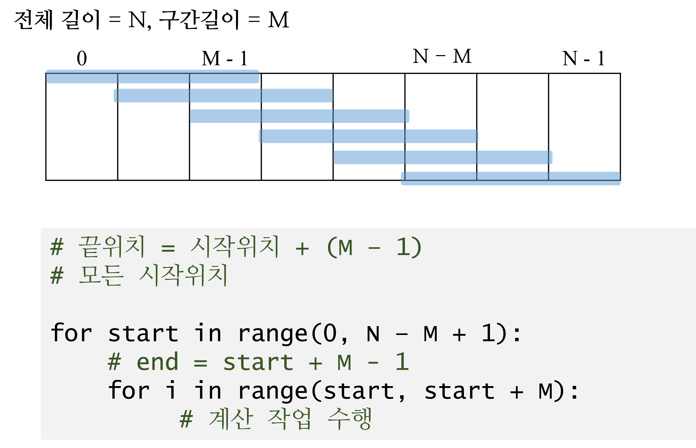
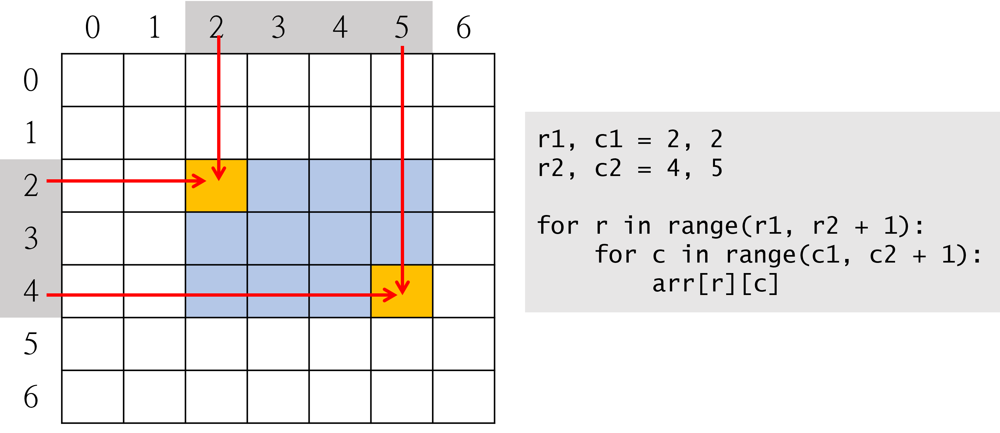
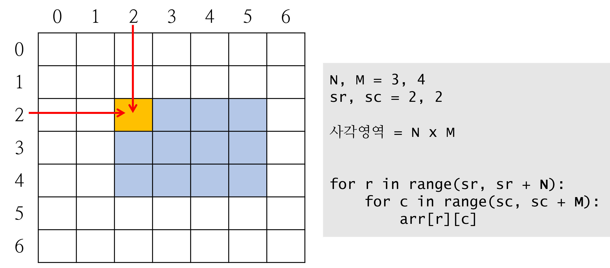

# 카운팅

- 자료값들이 양의 정수 --> 배열의 인덱스는 0 이상 양의 정수만 사용하므로
  
  - 파이썬은 음수 인덱스 사용가능하나, 문제를 풀때는 사용하지 않는다.
  
  - 마지막 요소인 arr[-1] 정도는 OK!!!!

- 그래서, 값을 배열 인덱스로 사용하려면 공간이 미리 생성되어야 한다.
  
  - 배열의 크기는 자료값 중에 최대값을 알야야 된다.
  
  - 지문에서 명시한 자료값의 범위를 확인

```python
MAX_VAL = 자료의 최대
cnt = [0] * (MAX_VAL + 1)
```

## 배열 순회

> - 항상 배열의 인덱스 범위에 주의해서 코드를 작성한다.
> 
> - 수식의 계산 결과를 배열의 인덱스로 사용하기 전에 유효한 값인지 체크하고 사용한다.


**1차 배열의 연속 구간**



**2차 배열에서의 사각 영역 표현**

> **좌상단 좌표와 우하단 좌표**



> **좌상단 좌표와 너비, 높이**



**활용하기**

- 테두리 영역의 합 구하기


---

# 델타 활용

# 분할
