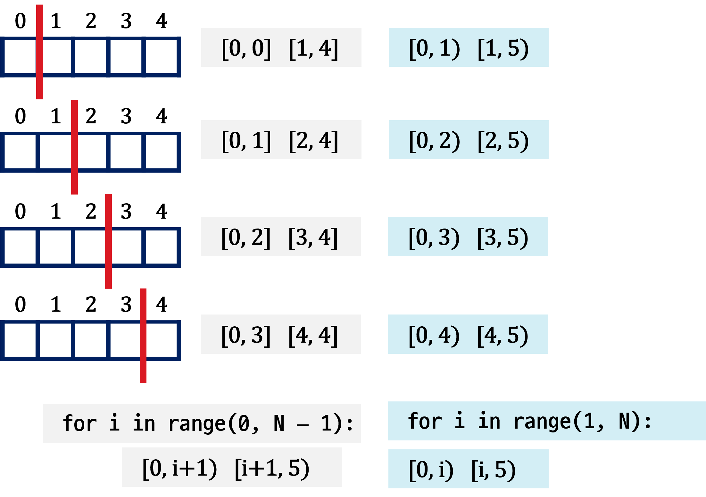
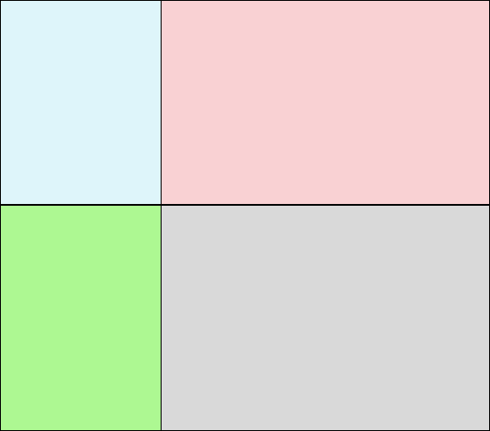
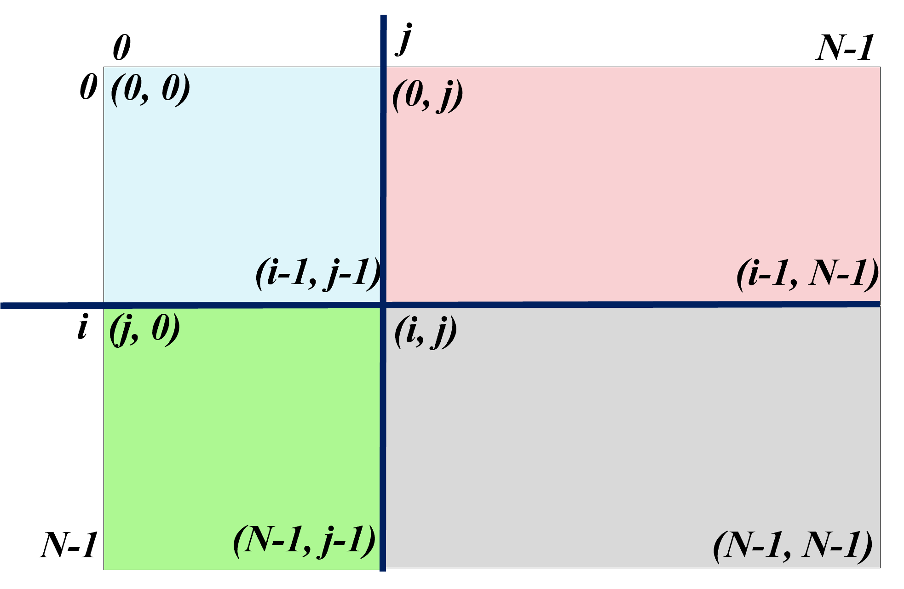

# 배열 분할

## 1차 배열 2 분할

- 크기가 5인 배열을 2분할하는 방법은 **4(=N-1)** 가지이다.
- 분할하는 위치를 **첫번째 구간의 끝** 인덱스, 또는 **두번째 구간의 시작** 인덱스로 결정 

## 1차 배열 3 분할

- 크기가 5인 배열을 3분할하는 방법은 **6(=4C2)** 가지이다.

## 2차 배열 분할

- 2차 배열을 4개의 직사각 영역으로 분할하기

- 1차 배열 2분할 활용하기

